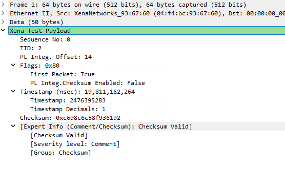
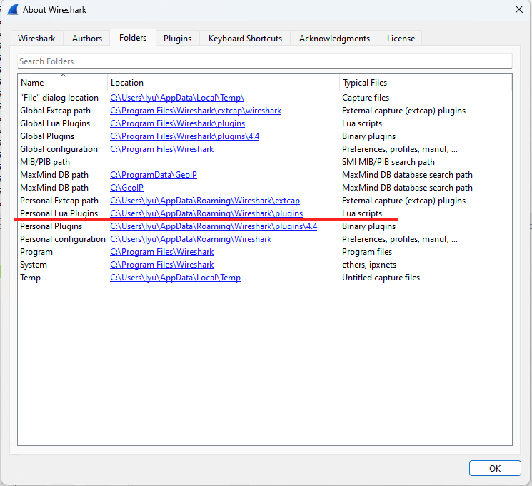

# Xena Wireshark Plugin v2 for TPLD

Xena offers a Wireshark integration via a dedicated LUA plugin. It allows users to easily read the information in the Xena test signature field. The plugin supports **Wireshark 3.x and above**.

## Why do you need it?
This plugin lets you view the fields of the "Xena test payload", which is found at the end of packets generated by Xena test ports (the last 20 bytes before FCS). This is not needed for everyday usage of the Xena testers, but may help you in various complex scenarios.

It is unusual for Wireshark to have things stored at the end, and not the beginning, of each packet. So Wireshark will not necessarily show the Xena test payload automatically, since it may ‘collide’ with the forwards-decoding of the packet. You can force the Xena decoding to be used via the “Decode as...” menu. 

## Install Xena Wireshark Plugin v2
1. Uninstall the existing ``Xena Wireshark Plugin 1.0`` from your Windows, if you have previously installed it.
2. Go to `Wireshark Main Window > Help > About Wireshark > Folders > Personal Lua Plugins`, click the blue Location to open plugin folder.
3. Delete the ``xenatpld-wplugin.lua``, if present.
4. Place ``xena_tpld.lua`` into the folder.
4. Place ``xena_utpld.lua`` into the folder.
5. Restart Wireshark.

## Uninstall Xena Wireshark Plugin v2
1. Go to `Wireshark Main Window > Help > About Wireshark > Folders > Personal Lua Plugins`, click the blue Location to open plugin folder.
2. Delete the ``xena_tpld.lua``.
2. Delete the ``xena_utpld.lua``.